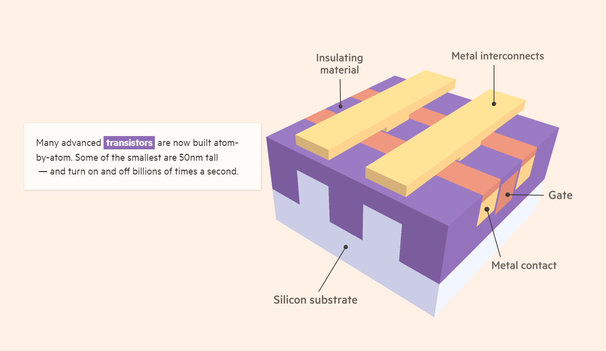

# 008-231213: Transistors

```
AC 220V

                                  DC
 ┌───────┐
 │       │                   ┌─┐
 │ BRIDGE│              ┌────┴─┴────┐
 │       │              │           │
 └──┬──┬─┘              │           │
    │  │                │           │
    │  │                └────┬────┬─┘
    │  │                     │    │
    │  └─ switch             │    │
    │    (relays)            │    │
    │  │ (or ssr)*           │    │
    │  │                     │    │
    │  │           +         │    │
    │  └─────────────────────┘    │
    │                             │
    └─────────────────────────────┘
                   -
*DC only
```
- AC -> [Bridge Circuit](notes\electronics_programming\004-231207_Memory_Electronics.md)  -> switch -> DC -> Motor
- put diodes next to relays to aborb surge voltages
- DC motor changes rotation by changing +-
- 5V 225 Ohm, 10V 1k Ohm are usual resistance values for voltages

## Using oscilloscopes

- Function generators make AC, can be measured with oscilloscopes
  

## Using one diode means...
- halves the current (?)


## Transistor
 source: https://ig.ft.com/microchips/
- made of base, collector, emitter
- 신호 증폭 작용 하기 위함
- 전류가 흐르면  on, 없으면 off
- modulates current flow
- 적은 전류로 작동 가능
- hfe 증폭비율 = collector current / base current
- FET = field effect transistor = 전압으로 제어 (전류 소모 거의 없음)
  - HC series
- BJT = bipolar junction transistor = 전류로 제어
  - LS series

### How do you identify FET and BJT?
BJT has three configurations: common emitter (CE), common base (CB) and common collector (CC). FET also has three configurations: common source (CS), common gate (CG) and common drain (CD). FET is comparatively smaller in size.


https://cafe.naver.com/eljet/11
https://cafe.naver.com/eljet/10