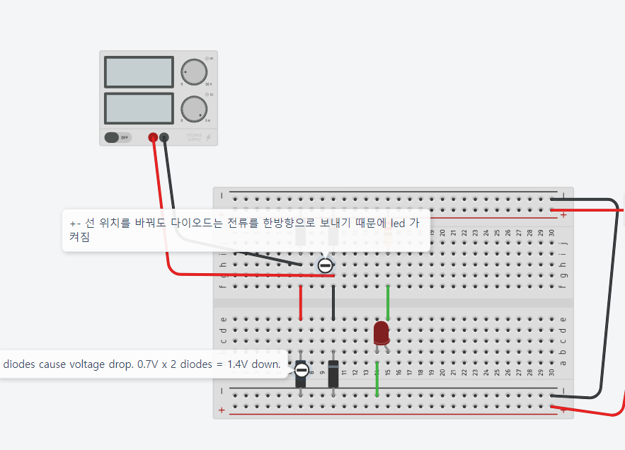
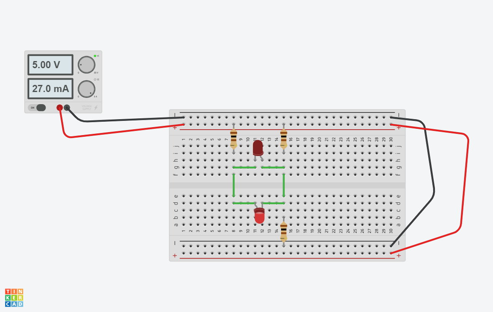
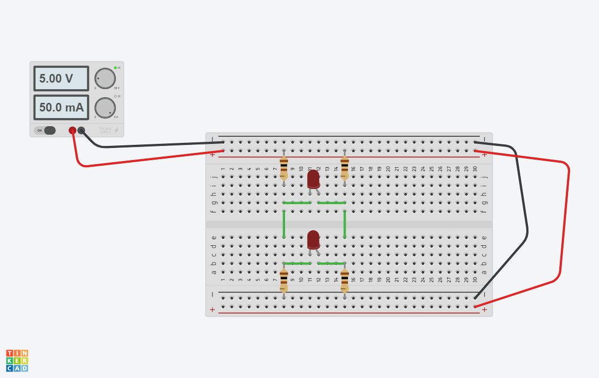

# 004 - 231207: Memory and electronics

# C Programming Basics
- atoi() turns string into int
	- need `#include <stdlib.h>`
- can escape percentage sign by `%%`
- array is in the format of `int arr[10] = { 1, 2, 3...}`;
- array length is `int arrLength = sizeof(arr) / sizeof(arr[0]);`
- can find memory address by `printf("%p", &arr[0])`
	- an outdated way to express it is `*arr` = `&arr[0]` or `*arr + 1` = `&arr[1]`

# Computer Memory
- In the page 3 of data sheet for HM6264, the block diagram shows how memory works in terms of hardware.
	- A4 ~ 11 is where address is called by name
	- Input data control part is where the data to be written into memory passes through
	- The read/write control part determines whether to read or write into memory.

Source: https://html.alldatasheet.com/html-pdf/64198/HITACHI/HM6264/745/3/HM6264.html

# 전기
- 5V, 104mA => R = V/I = 5/0.104Amps = 48 Ohm
- Use multimeter to measure resistance

## Diodes

Despite being nothing more than a simple two-pin semiconductor devices, diodes are vital to modern electronics. Some of their most common applications include turning AC to DC, isolating signals from a supply, and mixing signals.

Diodes can be used as rectifiers, signal limiters, voltage regulators, switches, signal modulators, signal mixers, signal demodulators, and oscillators. **The fundamental property of a diode is its tendency to conduct electric current in only one direction.**

- where/when is it used?
	- Diodes are used in **circuit protection** due to their ability to restrict electrical current to flow in only one direction. This trait is useful because some electrical components and devices will be damaged or malfunction if current flows in the wrong direction.
	- The diode works in DC since it is a unidirectional device. The diode allows the current to pass only in one direction. If the diodes are used in AC it will conduct only during half of the cycle. Thus they are used in the **conversion of AC into DC**.

- sillicon diodes have forward voltage drop of 0.6-0.7V. 
	- The voltage drop is a logarithmic function where every time you multiply your diode current by 10 you only lightly increase your voltage(on the order of 70mV in silicon). It is you pushing current across the small "depletion layer" of the diode. It's more like a drop in the physical analogy - moving towards ground.
		
Source:
	- https://www.lifewire.com/applications-of-diodes-818815
	-   https://www.power-and-beyond.com/what-is-a-diode-and-what-is-it-used-for-a-1dbd42298f6a18a89628b31611cb9efa/
	- https://byjus.com/physics/uses-of-diode/
	- https://www.fluke.com/en/learn/blog/electrical/what-is-a-diode
	- https://sciencing.com/connect-diodes-5462387.html
	
	
## Calculating current (amps) and power (watts)
- Given a simple 5V, 200 Ohm and LED circuit...
	- Check if each segment adds to 5V
	- If LED voltage is measured 1.8V, voltage on resistance is 5-1.8 = 3.2V
	- Calculate current flowing through 200 Ohm resistance by
		- I = 3.2 / 200 = 0.016A or 16mA
		- Electric power used on the resistance is P=VI=3.2 * 0.016 =  0.0512W
		- LED would be 1.8 * 0.016 = 0.0288W
		
Source: https://cafe.naver.com/eljet/7
		
## Bridge circuit

- are just 4 diodes put together in the same direction
- diode 통과시 0.7V 전압강하 발생
- enables led to light up even if the source power's +- flips.
- 브리지 다이오드 구매시 몇 amp 필요한지 알아야함

## H Bridge circuit

Akin to how water is (theoretically) static in between two blocks when water flows through two parallel blocks. No voltage is measured in the horizontal part.
=> If diagonal multiples of resistors are equal, LEDs in the middle don't turn on.

- when/where is it used?
https://wiraelectrical.com/h-bridge-circuit/

		
		

