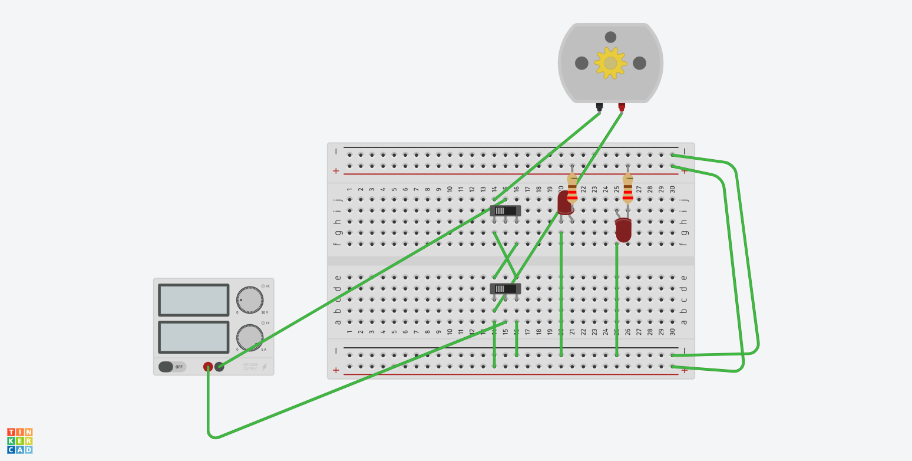
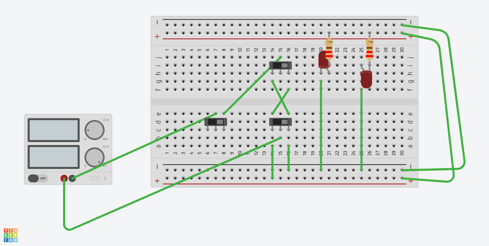

# 011-231218: Reversing Motors, Relays, Python

## Position of resistor does not matter in general
In general (that is, almost always) the location of a component in a series connection does not matter.  The exceptions generally have to do with the relationship of the part to other components as mediated by considerations that don't show up on schematics. It becomes important when there are multiple paths for current to travel in a circuit. If you need to control the path of current, or the value of voltage at a certain node, then the resistor placement (and value) becomes important.

You can think of a resistor as simply a piece of material with a lower conductivity than a wire (which is assumed to have infinite conductivity). At the boundary between two materials with different conductivities, the normal component of the current is continuous, which means that according to Ohm's law, the normal component of the electric field is discontinuous. So there is a buildup of charge at the boundary which acts as a "traffic jam", and limits the current which can flow through the entire series branch.

https://www.build-electronic-circuits.com/resistor-before-or-after-led/

https://electronics.stackexchange.com/questions/150627/when-does-the-placement-of-a-resistor-matter#:~:text=In%20general%20that%20is%2C%20almost,series%20connection%20does%20not%20matter

https://www.reddit.com/r/explainlikeimfive/comments/5kshcq/eli5_in_a_series_circuit_why_does_the_position_of/?rdt=64916

## Reversing motor direction with 6 pin switch or relay

[Relay - DC Motor schematics; reverse motor direction with relay](../../kicad/reversing_motor_direction)

- Magnetic switch for high load (30-40 Amps load of switch and motors)
- DPDT relay switch for low load (~5 Amps) -> 보통 비닐하우스 개폐기

## Relays
https://components101.com/switches/5v-single-channel-relay-module-pinout-features-applications-working-datasheet

https://electronics.stackexchange.com/questions/16556/identify-the-specifications-of-a-relay-from-the-writings-on-it

https://relaypros.com/choosing_proper_amperage.htm

https://www.instructables.com/All-You-Need-to-Know-About-Relays/

https://howtomechatronics.com/tutorials/arduino/control-high-voltage-devices-arduino-relay-tutorial/

https://electronics.stackexchange.com/questions/330441/what-the-different-values-written-on-relay-mean

## Python
- can find integer part of division with `//` operator. ` 7//4 = 1`