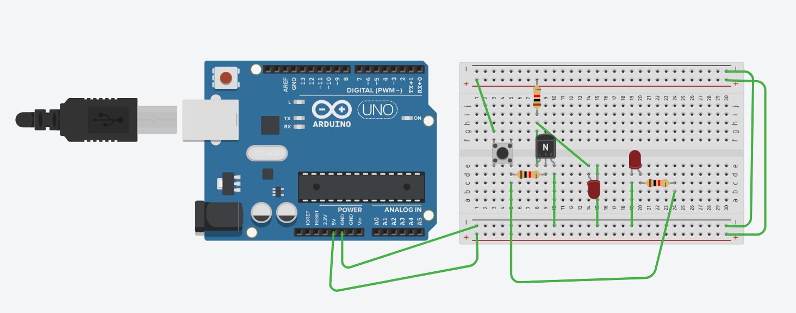
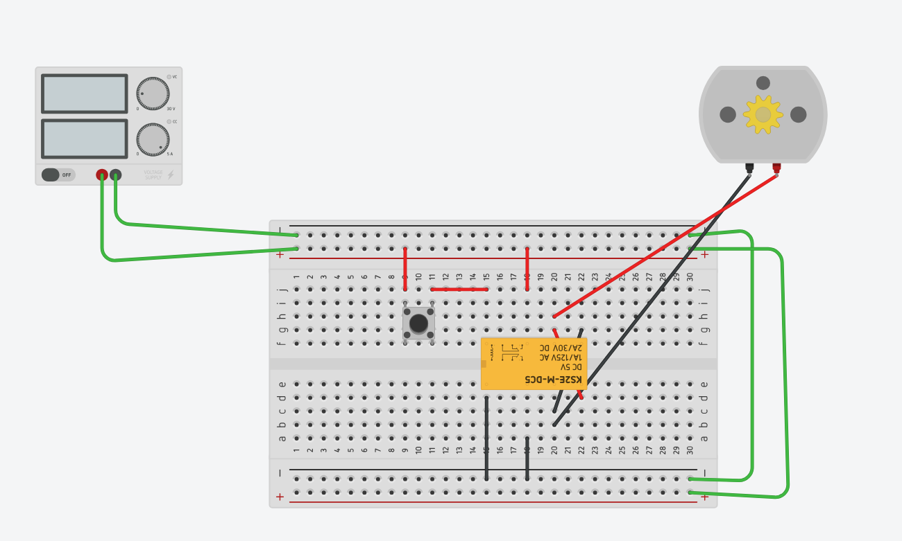

# 012-231220: Hysterisis, Op Amp

## Electronics basics
- 전류는 저항에 비례해서 흐름. 고로 걸리는 전압도 다름.
- In a series circuit where two resistors share the same node, start and end voltage is the same.

## 히스테리시스 (자화) 곡선과 기호
- 히스테리시스성을 가지고 있다 = 기준을 왔다갔다 하면서 통제 
- 잡음 회로에 강함
- 외부랑 인터페이스 해주는 부품에 들어가는 기호

https://cafe.naver.com/eljet/15

## Op Amp
An operational amplifier (op-amp) is an integrated circuit (IC) that amplifies the difference in voltage between two inputs. It is so named because it was developed for perform arithmetic
