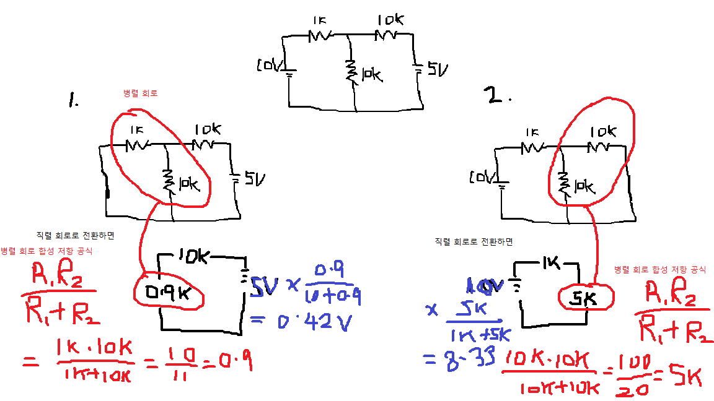

## 중첩의 원리

중첩의 원리로 중간 저항에 걸리는 전압 구하기.
총 0.42V + 8.33 = 8.75V.

## 테브낭의 정리
중간 저항 값이 바뀔때 계산하기 유용.
중첩의 원리와 테브낭의 정리는 전기 회로에서 전압 및 전류를 계산하는 데 사용되는 두 가지 중요한 방법입니다. 어떤 상황에서 어떤 원리를 사용해야 하는지에 대한 결정은 회로의 구조와 특성에 따라 다릅니다.

중첩의 원리 (Superposition Principle):
중첩의 원리는 선형 시스템에서 적용 가능하며, 다양한 입력이 동시에 가해진 경우 각각의 입력에 대한 효과를 독립적으로 계산한 후 합산함으로써 전체 시스템의 응답을 얻을 수 있습니다.
복잡한 회로가 여러 독립적인 입력을 갖는 경우, 중첩의 원리를 사용하여 각 입력에 대한 전압이나 전류를 쉽게 계산할 수 있습니다.
주로 선형 회로에서 적용되며, 비선형 요소가 없거나 중요하지 않을 때 유용합니다.
테브낭의 정리 (Thevenin's Theorem):
테브낭의 정리는 선형 회로에 대한 간소화된 모델을 제공하며, 회로를 단일 전압 소스와 등가 전압, 등가 내부 저항으로 대체합니다.
특정 부분 회로에만 관심이 있는 경우, 테브낭의 정리를 사용하여 해당 부분을 대표할 수 있는 단순한 등가 회로를 구성할 수 있습니다.
주로 복잡한 회로를 단순화하고, 특정 부분 회로에 대한 분석을 용이하게 하기 위해 사용됩니다.
따라서, 회로의 특성과 분석하려는 부분에 따라 중첩의 원리 또는 테브낭의 정리를 선택하게 됩니다. 일반적으로는 중첩의 원리가 여러 입력이 동시에 가해진 경우에 유용하며, 테브낭의 정리는 회로를 간소화하고 특정 부분을 분석하기 위해 사용됩니다.

## Different kinds of flip flop circuits:
- 쌍안정 = Set / Reset 회로.
- 비안정 = 발진 회로. + - 왔다갔다하는 회로.
- 단안정 = 안정상태 후 일정 시간후 상태가 바뀌는 회로. 타이머.

## Op Amp
고속 lm393 dual voltage comp comparator (a kind of op amp ) circuit works by comparing the voltages of two inputs; if the voltage on one side is more (or less) than the other, the circuit activates.

LM339
https://youtu.be/KxslqtC_wIw?si=rv04wtGtMvWYMNnq

M36301
A rail to rail op amp. 끝까지 (최대 supply voltage 까지) 커버하는 op amp.

## RS232와 RS485의 차이점은 무엇입니까?
https://www.stoneitech.com/ko/what-is-the-difference-between-rs232-and-rs485/
https://www.seeedstudio.com/blog/2021/03/18/how-rs485-works-and-how-to-implement-rs485-into-industrial-control-systems/#:~:text=RS485%20is%20used%20in%20many,controller%20and%20a%20disk%20drive.