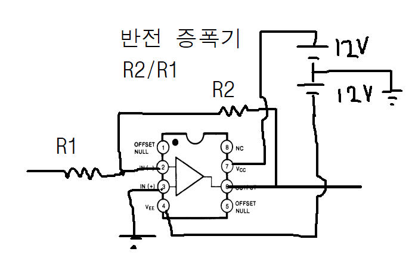
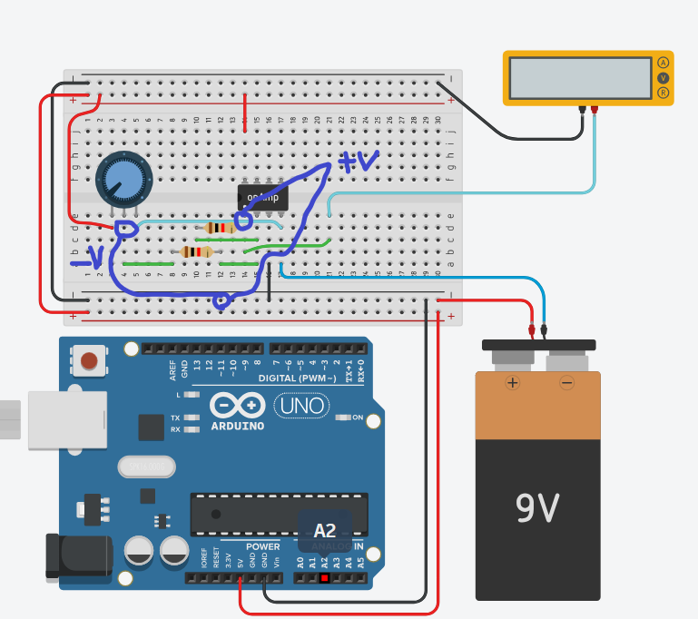

# Stepping motors and H Bridge
Bi-polar (극성을 뒤집는) 스테핑 모터에서 H-bridge 가 종종 쓰임. Without H Bridge there won't be enough current to supply the motor from Arduino. 2 x H bridges are used for circuits that require big motors.

# Encoder
https://cafe.naver.com/circuitsmanual?iframe_url_utf8=%2FArticleRead.nhn%253Farticleid%3D20311%2526clubid%3D18968931
http://www.automation.co.kr/clock/secuni.htm

# OpAmp TL072
https://circuitdigest.com/electronic-circuits/positive-and-negative-feedback-in-op-amp-circuits

