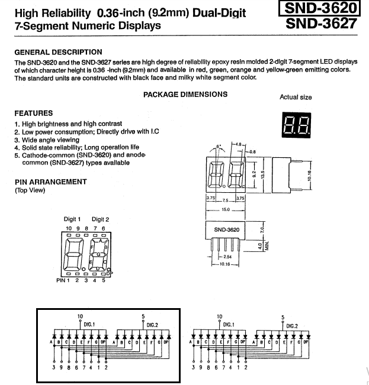

# SND3620SR

- Functions when input voltage is low (turns LED ON) as well as high by slightly altering circuit diagram.
  - Left: function when input voltage is high
  - Right: function when input voltage is low; another source provides voltage to turn LED ON and when there's input voltage, the circuit shorts to ground and turns LED OFF.
- 8051 MCUs use the "LED HIGH when input voltage is LOW" circuit because the MCU has low output voltage.
- Arduino R3 and above have high voltage, so we will use the circuit on the left.