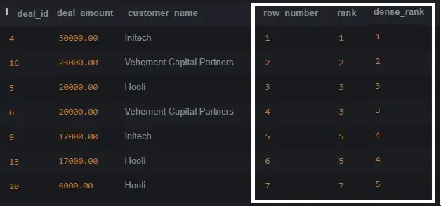

# Types of Window Functions
1. Ranking functions
2. Aggregate functions
3. Positional functions


# Ranking Window Functions
Rank the rows in each partition. The main ranking functions are:
- ROW_NUMBER() assigns sequential number to rows
- RANK() assigns sequential number to rows with **same number for ties**, so it can result in more than specified top X result.
- DENSE_RANK() assigns sequential numbers to rows, with the same number for ties, and without compensating for the ties in the next rows.

If your question is “What are the 5 biggest deals in each region”, you need to decide which of the answers you want:



ROW_NUMBER - will give the top 5, but will miss the 6th one that is tied to the 5th.

RANK - will give you 6 results, accounting for the tie for the 5th place.

DENSE_RANK - will give you 7 results, for any deals that have a deal_amount in the top 5 amounts.

# Aggregate Window Functions
Very similar to GROUP BY aggregations, but with a huge advantage - you can keep the full data for each row!
- SUM()
- AVG()
- MAX()

i.e For each deal, select the % that the deal represents in its region.

```
SELECT
  deal_id, deal_amount, customer_name, region, deal_date,
  ROUND((deal_amount / SUM(deal_amount) OVER (PARTITION BY region)) * 100, 2) AS percentage_of_total_in_region
FROM deals
ORDER BY region, deal_date;
```

i.e.2 For each deal, select the % that the deal represents in aggregate of all regions
```
SELECT
  deal_id, deal_amount, customer_name, region, deal_date,
  ROUND((deal_amount / SUM(deal_amount) OVER ()) * 100, 2) AS percentage_of_total_across_regions
FROM deals;
```

# Positional Window Functions
These functions return a single value from a particular row in each window frame. For example:

- LEAD(): Returns a value from a row that follows the current row within the partition.
- LAG(): Returns a value from a row that precedes the current row within the partition.
- FIRST_VALUE(): Returns the first value in the partition.
- LAST_VALUE(): Returns the last value in the partition.

i.e For each deal, calculate the change in deal amount from the previous deal by the same customer in the same region.
```
SELECT deal_id, deal_amount, customer_name, region, deal_date,
  deal_amount - LAG(deal_amount) 
     OVER (PARTITION BY customer_name, region ORDER BY deal_date) 
     AS deal_change_from_previous
FROM deals
ORDER BY customer_name, region, deal_date;
```